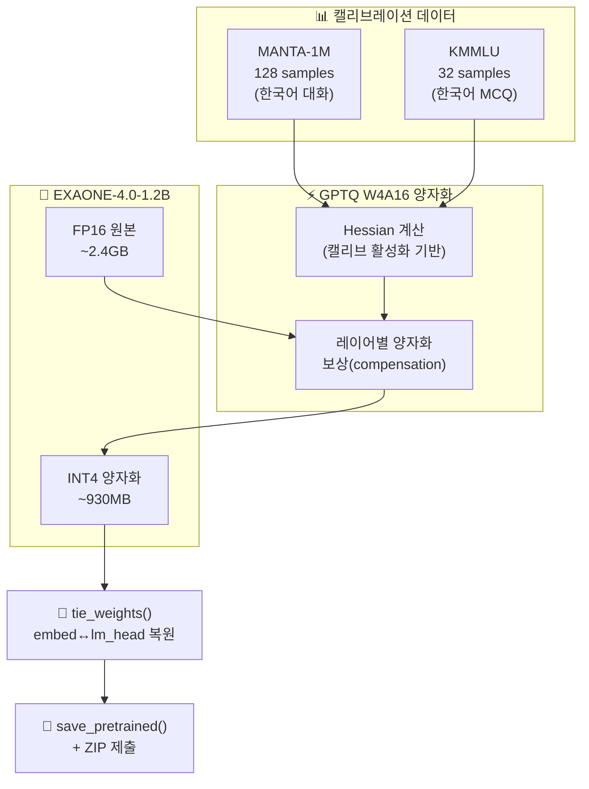

<div align="center">

# 🧬 LG Aimers 8기 — LLM 경량화 (Quantization) 해커톤

**EXAONE-4.0-1.2B 모델의 성능 유지 × 추론 속도 최적화를 위한 GPTQ 양자화 전략**

[](https://www.python.org/)
[](https://pytorch.org/)
[](https://huggingface.co/)
[](https://github.com/vllm-project/vllm)
[](https://arxiv.org/abs/2210.17323)

`DACON` · `LG AI Research` · `2026.02` · **239위 / 628팀** · **Score: 0.59878**

</div>

---

## 📌 Key Highlights

| | |
|:---|:---|
| 🏆 **결과** | **239위 / 628팀**, Score **0.59878** |
| ⚡ **핵심 전략** | GPTQ W4A16 양자화 + 2-Source 캘리브레이션 (MANTA + KMMLU) |
| 📈 **개선** | 베이스라인(0.5914) → 최종(0.59878) — 캘리브레이션 도메인 정렬로 +0.74%p |
| 🧪 **실험적 시도** | Pre-GPTQ LoRA 정렬 (QAT-inspired approach) |
| 🔧 **해결한 기술 이슈** | Tied weights 복원, KMMLU subset 순환 로드, submit.zip 경로 구조 |

---

## 🔍 과제 정의

EXAONE-4.0-1.2B 모델을 대상으로 경량화 기법(양자화, 프루닝, 파인튜닝 등 제한 없음)을 적용하여, HuggingFace 표준 형식으로 제출. 운영진의 **동일한 vLLM 추론 환경**(A10G, CUDA 12.8)에서 **성능과 추론 속도를 동시에 평가**합니다.

$$\text{Score} = \max\left(0.5 \times \text{Perf\_norm} + 0.5 \times \text{SpeedNorm}, \ 0\right)$$

> 단순히 파라미터를 줄이면 속도↑ 성능↓, 성능을 유지하면 경량화 수준↓ 속도↓ — 이 **트레이드오프의 최적점**을 찾는 것이 핵심

---

## 🏗️ Architecture



---

## ⚙️ 핵심 방법론

### 1. GPTQ 양자화 — Hessian 기반 최적 가중치 근사

OBS(Optimal Brain Surgeon) 기반의 Post-Training Quantization. 한 가중치를 양자화할 때 발생하는 출력 오차를 같은 행의 나머지 가중치에 **보상(compensation)** 하여 레이어 전체 출력 오차를 최소화합니다.

| 파라미터 | 값 | 설계 근거 |
|:---:|:---:|:---|
| 양자화 스킴 | **W4A16** | 가중치 4-bit, 활성화 16-bit → 속도↑ 성능 유지 |
| Group size | **128** | 그룹별 scale/zero-point → 정밀도와 오버헤드 균형 |
| Ignore | embed_tokens, lm_head | tied weights 구조 보존 |
| Dampening | 0.01 | Hessian 역행렬 수치 안정성 |

### 2. 2-Source 캘리브레이션 전략 (최종 제출)

GPTQ의 Hessian은 캘리브레이션 데이터의 활성화 통계로 계산됩니다. **평가 도메인(한국어 MCQ)과 유사한 KMMLU를 혼합**하여 Hessian 추정 정확도를 향상시켰습니다.

| 데이터 | 샘플 | 역할 |
|:---|:---:|:---|
| **MANTA-1M** | 128 | 한국어 일반 대화 — 범용 분포 커버 |
| **KMMLU** | 32 | 한국어 MCQ — 평가 도메인 정렬 |

### 3. Pre-GPTQ LoRA 정렬 (QAT-inspired, 실험적)

양자화 전에 LoRA fine-tuning으로 가중치 분포를 캘리브레이션 데이터에 사전 정렬하는 실험:

```
FP16 → LoRA (200 steps, r=16, α=32) → merge → GPTQ W4A16 → tie_weights → save
```

### 4. 해결한 기술적 이슈

| 이슈 | 원인 | 해결 |
|:---|:---|:---|
| **모델 크기 2배 증가** | tied weights 연결이 양자화 후 끊어짐 | `tie_weights()` 명시적 호출 |
| **KMMLU 전체 로드 불가** | "all" config 미존재 | 과목별 subset 순환 로드 |
| **submit.zip 경로 오류** | Colab 절대 경로 포함 | root_dir/base_dir 분리 |

---

## 📊 실험 결과

| 실험 | 기법 | 캘리브레이션 | Score | 비고 |
|:---:|:---|:---|:---:|:---|
| Try_000 | GPTQ W4A16 | MANTA 128 | 0.5914 | 베이스라인 |
| **Try_014** | **GPTQ W4A16** | **MANTA 128 + KMMLU 32** | **0.59878** | **최종 제출** ✅ |
| Try_017 | LoRA + GPTQ | MANTA 128 + KMMLU 32 | 미제출 | 실험적 |

### 폐기된 실험

| 실험 | 폐기 근거 |
|:---|:---|
| AWQ | vLLM + A10G 환경에서 GPTQ 대비 성능 열위 |
| Pruning + LoRA | 1.2B 규모에서 프루닝 시 성능 손실 과도, 복원 불가 |
| Seq length 1024 | RAM 25.8GB 필요 → 메모리 한계 초과 |
| Data shuffle/filter | 유의미한 성능 변화 없음 |

---

## 🧠 핵심 기술 설계 로직

<details>
<summary><b>GPTQ의 원리 (OBS 기반)</b></summary>

> Hessian의 역행렬 정보를 활용하여, 양자화 오차가 레이어 출력에 미치는 영향을 최소화하도록 나머지 가중치를 조정합니다. dampening_frac=0.01은 수치 불안정성 방지를 위한 정규화 항입니다.
</details>

<details>
<summary><b>Group Quantization (block_size=128)</b></summary>

> 가중치 전체에 하나의 scale을 적용하면 정밀도가 떨어지고, 개별 scale은 오버헤드가 과도합니다. 128개 단위 그룹별 scale/zero-point가 균형점입니다.
</details>

<details>
<summary><b>캘리브레이션 데이터와 Hessian 추정</b></summary>

> H = X^T X (X=캘리브레이션 활성화)는 각 가중치의 출력 민감도입니다. 캘리브레이션이 추론 입력 분포를 반영할수록 H 추정이 정확해지고 양자화 손실이 감소합니다.
</details>

<details>
<summary><b>Tied Weights 처리</b></summary>

> EXAONE은 embed_tokens과 lm_head가 가중치를 공유(tie)하는 구조입니다. 양자화 후 저장 시 이 연결이 끊어지면 814MB → 1.4GB로 증가하므로, `tie_weights()` 호출로 복원합니다.
</details>

---

## 📁 프로젝트 구조

```
LG_aimers/
├── code/
│   ├── base_model/                   # EXAONE-4.0-1.2B 원본
│   ├── Try_000.ipynb                   # GPTQ ۲�이스라인
│   ├── Try_014_gptq_bench.ipynb        # ★ 최종 제출
│   ├── Try_017_lora_gptq.ipynb        # LoRA + GPTQ 실험
│   └── trash/                          # 폐기된 실험 (24개)
├── repo/
│   └── README.md
└── notion_document.md
```

---

## 📎 References

| | |
|:---|:---|
| 🏆 | [DACON 대회 페이지](https://dacon.io/competitions/official/236673/overview/description) |
| 🤗 | [EXAONE-4.0-1.2B (HuggingFace)](https://huggingface.co/LGAI-EXAONE/EXAONE-4.0-1.2B) |
| 🔧 | [llmcompressor (vLLM)](https://github.com/vllm-project/llm-compressor) |
| 📄 | [GPTQ 논문 — Frantar et al. (2023)](https://arxiv.org/abs/2210.17323) |
| 📊 | [KMMLU Dataset](https://huggingface.co/datasets/HAERAE-HUB/KMMLU) · [MANTA-1M](https://huggingface.co/datasets/maywell/MANTA-1M) |
